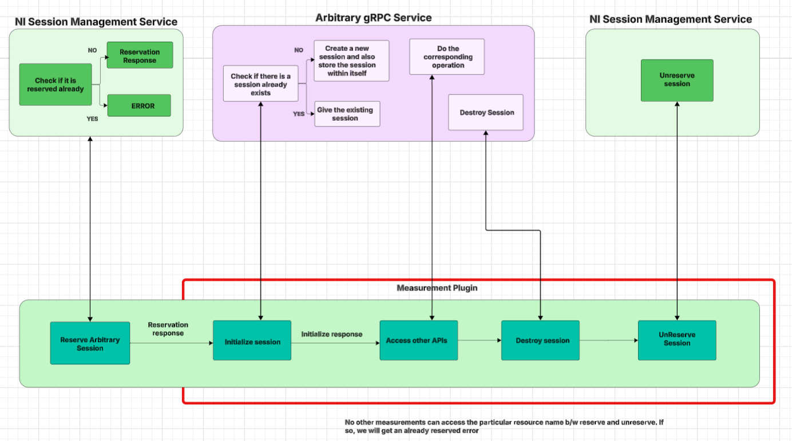
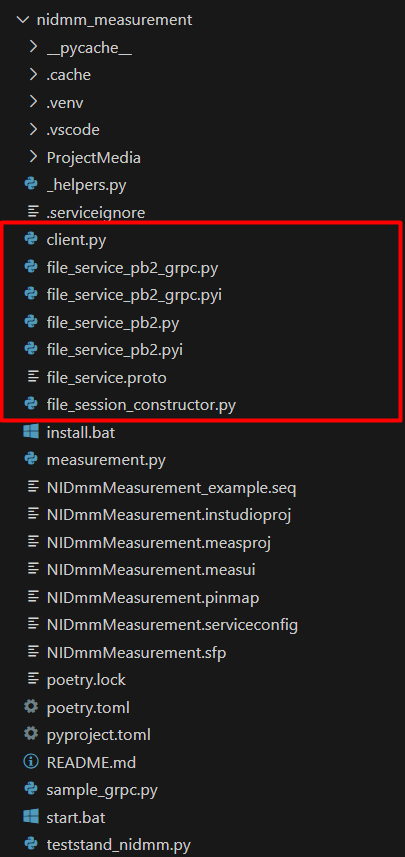

# Session Management for Arbitrary Session

- [Session Management for Arbitrary Session](#session-management-for-arbitrary-session)
  - [Who](#who)
  - [Feature WorkItem](#feature-workitem)
  - [Problem Statement](#problem-statement)
    - [Key Requirements](#key-requirements)
  - [Workflow](#workflow)
  - [Proposed Design \& Implementation](#proposed-design--implementation)
    - [Session Reservation \& Registration](#session-reservation--registration)
    - [Session Sharing](#session-sharing)
      - [gRPC Service APIs](#grpc-service-apis)
      - [Service Registration in Discovery Service](#service-registration-in-discovery-service)
      - [Session Initialization](#session-initialization)
  - [Alternate Design for Session Reservation \& Registration](#alternate-design-for-session-reservation--registration)
    - [Introducing APIs for Arbitrary Sessions](#introducing-apis-for-arbitrary-sessions)
  - [Alternate Design for Session Sharing](#alternate-design-for-session-sharing)
    - [Centralized Session Registry Server](#centralized-session-registry-server)
    - [Create a Server Similar to NI gRPC Device Server](#create-a-server-similar-to-ni-grpc-device-server)
    - [Extending the Existing NI gRPC Device Server](#extending-the-existing-ni-grpc-device-server)
  - [Future Work Items](#future-work-items)

## Who

- Author: National Instruments
- Team: _Intelligent Validation_  

## Feature WorkItem

[Feature: Create a custom instrument example to demonstrate session management](https://dev.azure.com/ni/DevCentral/_workitems/edit/3154212)

## Problem Statement

A solution is needed to manage and share arbitrary sessions—such as custom instruments, data communication etc., ensuring controlled access through a session reservation mechanism to prevent conflicts. The current example could be improved or added with a new variant that better resonates with the users.

### Key Requirements

**Session Reservation:** A mechanism to reserve and unreserve sessions that prevents simultaneous access by multiple measurement plugins, thereby avoiding conflicts.

**Session Registration:** A mechanism to register and unregister sessions in the session management service to enable the TestStand sequence workflow.

**Session Sharing:** A mechanism to allow measurement plugins to share arbitrary sessions.

## Workflow



A step-by-step user guide, along with Python and LabVIEW examples, will be provided to help users implement session reservation and the sharing of arbitrary sessions. The reference guide and examples will cover everything from defining arbitrary functions as a gRPC service to reserving and registering sessions using session management service APIs for both Python and LabVIEW. It will also guide users on implementing session sharing using the appropriate [initialization behavior ENUM](https://github.com/ni/measurement-plugin-python/blob/001af74269501f874aa4f092ee2963bb9290348e/packages/service/ni_measurement_plugin_sdk_service/session_management/_types.py#L457C1-L457C46) on the server side.

The high-level workflow is outlined below, with detailed instructions available in the deliverable - **User Reference Guide**.

1. **User has to Create a gRPC Service for the Arbitrary Functions**  
   - Implement the logical functions that need to be exposed to the client on each function call (e.g., database or file operations).  
   - Include session-handling APIs (e.g., `InitializeSession`, `DestroySession`).
   - An example proto file for a custom instrument called `KeyvoltDMM` with read/configure functions to be hosted as gRPC service is shown below.

      ```proto
         syntax = "proto3";

         // Define the package name
         package KeyvoltDMM;

         // Define the BasicKeyvoltDMM service with its RPC methods
         service ProbeMate {
            rpc Initialize (InitializeInputs) returns (SessionInformation) {}
            rpc Close (SessionInformation) returns (StatusInfo) {}
            rpc ConfigureMeasurement (ConfigureMeasurementInfo) returns (SessionInformation) {}
            rpc ReadSinglePoint (SessionInformation) returns (ReadSinglePointResult) {}
         }

         // Message to return status information
         message StatusInfo {
            string status = 1;
         }

         message SessionInformation {
            uint64 session_id = 1;
         }

         // Enumeration for baud rates
         enum BaudRate {
            BAUDRATE_300 = 0;
            BAUDRATE_600 = 1;
            BAUDRATE_1200 = 2;
            BAUDRATE_2400 = 3;
            BAUDRATE_4800 = 4;
            BAUDRATE_9600 = 5;
            BAUDRATE_19200 = 6;
         }

         // Enumeration for parity settings
         enum Parity {
            NONE = 0;
            ODD = 1;
            EVEN = 2;
         }

         // Enumeration for data bits settings
         enum DataBits {
            SEVEN = 0;
            EIGHT = 1;
         }

         // Message to hold serial configuration settings
         message SerialConfiguration {
            BaudRate baud_rate = 1;
            Parity parity = 2;
            DataBits data_bits = 3;
         }

         // Message to hold inputs for initializing the VISA resource
         message InitializeInputs {
            string visa_resource_name = 1;
            bool id_query = 2;
            bool reset = 3;
            SerialConfiguration serial_configuration = 4;
         }

         // Enumeration for measurement functions
         enum Function {
            DC_VOLTAGE = 0;
            AC_VOLTAGE = 1;
            TWO_WIRE_RESISTANCE = 2;
            FOUR_WIRE_RESISTANCE = 3;
            DC_CURRENT = 4;
            AC_CURRENT = 5;
            FREQUENCY = 6;
            PERIOD = 7;
            CONTINUITY = 8;
            DIODE_CHECKING = 9;
            VDC_VCD_RATIO = 10;
            TEMPERATURE = 11;
            CAPACITANCE = 12;
         }

         // Enumeration for manual resolution settings
         enum ManualResolution {
            RESOLUTION_4_5_DIGITS = 0;
            RESOLUTION_5_5_DIGITS = 1;
            RESOLUTION_6_5_DIGITS = 2;
         }

         // Message to hold configuration settings for a measurement
         message ConfigureMeasurementInfo {
            SessionInformation session_info = 1;
            Function function = 2;
            bool enable_auto_range = 3;
            ManualResolution manual_resolution = 4;
            double manual_range = 5;
         }

         // Message to return the result of a single point measurement
         message ReadSinglePointResult {
            SessionInformation session_info = 1;
            double measurement = 2;
         }

         // Similary other APIs for the core functionalities should be defined.
      ```

2. **User has to Implement Session Initialization Behavior**  
   - Within the gRPC server, implement the logic to initialize and manage sessions based on the selected initialization behavior. The logical implementation of session initialization is as follows:

     - INITIALIZE_SERVER_SESSION - Initialize a new session, and store and share it with the client.
     - ATTACH_TO_SERVER_SESSION - Attach to an existing session with the specified name and share it with the client.
     - AUTO - Attach to an existing session if available; otherwise, initialize a new  session and share it with the client.
     - INITIALIZE_SESSION_THEN_DETACH - Initialize a new session and detach instead of closing when exiting the context manager for future use.
     - ATTACH_TO_SESSION_THEN_CLOSE - Attach to an existing session and automatically close it when exiting the context manager.
   - A Python server side example is given for the AUTO initialization behavior.

      ```py
      class KeyvoltDmmServicer(KeyvoltDmm_pb2_grpc.KeyvoltDmmServicer):
         def __init__(self):
            self.Instr_sessions = {}

         def Initialize(self, request, context):
            # Example: AUTO initialization behavior
            if request.initialization_behavior == keysightdmm_pb2.AUTO:
               # Check if a session already exists for the given VISA resource
               for session_id, session_info in self.Instr_sessions.items():
                  if session_info['visa_resource_name'] == request.visa_resource_name:
                     return keysightdmm_pb2.SessionInformation(session_id=session_id)

               # Otherwise, create a new session
               session_id = str(uuid.uuid4())
               # Here, you would initialize the actual instrument session (stubbed below)
               session_info = {
                  'visa_resource_name': request.visa_resource_name,
                  'id_query': request.id_query,
                  'reset': request.reset,
                  'serial_configuration': request.serial_configuration,
                  # Add any other session-specific data as needed
               }
               self.Instr_sessions[session_id] = session_info

               return keysightdmm_pb2.SessionInformation(session_id=session_id)
      ```

3. **Host & Register the gRPC Service**
   - Host the CustomInstrument as gRPC service.
   - Register the service with the Discovery Service to ensure measurement plugins can dynamically discover and connect to it.

      ```py
      def serve():
         # Create a gRPC server with multiple worker threads
         server = grpc.server(futures.ThreadPoolExecutor(max_workers=10))

         # Add the KeyvoltDmmServiceServicer to the server
         keyvolt_dmm_pb2_grpc.add_KeyvoltDmmServicer_to_server(KeyvoltDmmServicer(), server)

         # Define host and assign a free available port
         host = "[::1]"
         port = str(server.add_insecure_port(f"{host}:0"))  # Bind to an available port

         # Start the server
         server.start()

         # Register the service with the discovery system
         discovery_client = DiscoveryClient()
         service_info = ServiceInfo(
            service_class=GRPC_SERVICE_CLASS,
            description_url="Custom DMM Instrument",
            provided_interfaces=[GRPC_SERVICE_INTERFACE_NAME],
            display_name=DISPLAY_NAME,
         )
         registration_id = discovery_client.register_service(
            service_info=service_info, service_location=ServiceLocation("localhost", port, "")
         )

         # Keep the server running until user input is received
         input("Press Enter to stop the server...")

         # Unregister the service and gracefully shut down the server
         discovery_client.unregister_service(registration_id)
         server.stop(grace=5)
         server.wait_for_termination()
      ```

4. **Generate and Customize Language-Specific Client Files**
   - Generate client stubs from the .proto file.
   - Create new files from the generated stubs, such as:
     - Create client interface using the generated stubs.
     - Create a session constructor for the created client.
   - The created files will be used in the measurement plugin for session initialization.

      

   ```py
      # Session Constructor for managing instrument sessions
      class KeyvoltDmmSessionConstructor:
         def __init__(self, resource_name, initialization_behavior):
            # Store file resource name and initialization behavior
            self.resource_name = resource_name
            self.initialization_behavior = initialization_behavior

         def __call__(self) -> KeyvoltDmmClient:
            # Create and return a client instance
            return KeyvoltDmmClient(self.resource_name, self.initialization_behavior)
   ```

5. **Create Custom Instrument in PinMap**:
   - This design uses pin-centric workflow and requires a custom instrument in the PinMap to be associated with the arbitrary gRPC service.
   - The instrument type ID defined in the pinmap is required when calling the session management service’s initialization API.

6. **Reserve the Resource in the Measurement Plugin**  
   - Call the **Reserve Session API** of the existing session management service.

7. **Initialize the Session**  
   - Invoke the gRPC server’s `InitializeSession` (or equivalent) from the measurement plugin.  

8. **Perform Operations**  
   - Execute desired tasks (e.g., database queries, file I/O) through the gRPC service.  

9. **Unreserve the Session**  
   - After finishing, call the **Unreserve Session API** so others can reserve and use it.
  
```py
   # Instrument type ID (should match the one in the PinMap)
   instrument_type_id = "KeyvoltDMM"

   # Create a session constructor for the custom instrument with auto-initialization
   custom_instr_session_constructor = KeyvoltDmmSessionConstructor(visa_resource_name, InitializationBehavior.AUTO)

   # Reserve the session for the given VISA resource
   with measurement_service.context.reserve_session(visa_resource_name) as arbitrary_reservation:
      # Initialize the session using the session constructor
      with arbitrary_reservation.initialize_session(custom_instr_session_constructor, instrument_type_id) as arbitrary_session_info:
         custom_instr_session = arbitrary_session_info.session  # Extract the active session
         
         # Configure the measurement (example: DC voltage)
         custom_instr_session.ConfigureMeasurement(function=Function.DC_VOLTAGE, enable_auto_range=True)
         
         # Read a single point measurement and print the result
         result = custom_instr_session.ReadSinglePoint()
         print(f"Measurement: {result.measurement}")
```

## Proposed Design & Implementation

To address the problem, a reference guide and example for both Python and LabVIEW will be provided which will demonstrate how to manage and share arbitrary sessions (e.g., database connections, file connections) across multiple measurement plugins. The solution will incorporate the session reservation mechanism using the existing session management service.

In this workflow, users are expected to define core functionalities as APIs in the proto file and then host them as a gRPC service.

### Session Reservation & Registration

In this proposed workflow, the existing APIs such as reserves session, unreserve session, register session, unregister session and reserve all registered sessions of session management service will be used for arbitrary session reservation and registration.

**Advantages**

**No Modifications to Session Management Service:** This approach allows the leveraging of existing session management service without requiring any modifications to it.

The first version of the solution aims to cover only pin-centric workflows. Since the session reservation capability applies to arbitrary sessions, the pin map service (pin-centric workflow) is applicable as it avoids additional overhead such as manual hardware definitions in NI MAX or JSON updates, which are mandatory in the non-pin-centric workflow.

Extending the IO Discovery Service (non-pin-centric workflow) is not suitable due to the following reasons:

- **Dependency on Hardware Configuration**: The IO Discovery Service retrieves information from a JSON file containing details about connected hardwares and instruments configured in **NI MAX**. This would require users to manually enter service-related details in the JSON, adding unnecessary overhead.

- **Conflict with Pin Map Context**: If the pin map set to active and used by a measurement plugin, the session management service does not query the IO Discovery Service. This would restrict session reservation of arbitrary resources for pin-centric measurement plugins.

**Disadvantages**

**Lacks support for non pin centric workflow**: Since the user is required to define the custom instrument in the pin map and make the pin map active, the measurement plugins that are non-pin-centric will not be able to reserve the session as the activeness of pin map hinders the session management service to query the IO Discovery Service.

### Session Sharing

This solution delegates session management responsibilities (storage and retrieval) to the **gRPC service**. The service must:

- Maintain and manage active sessions.
- Be discoverable via the **Discovery Service**.
- Expose its core functionalities through APIs based on its intended purpose. For example, if the service is designed for file logging, it should include APIs for reading, writing, and creating files.

#### gRPC Service APIs

In addition to core functionalities, the gRPC service should implement the following APIs:

- **InitializeSession(request: InitializeSessionRequest) -> InitializeSessionResponse** The request will include the resource name for which a session needs to be initialized. The response will return a session ID upon successful initialization. If initialization fails, the response will instead provide an error message detailing the reason for the failure.
- **DestroySession(request: DestroySessionRequest) -> DestroySessionResponse** The request will contain the session ID to be terminated. The response will indicate the outcome, returning either a success message upon successful termination or an error message if the process encounters an issue.

These APIs establish and terminate session connections. They may be named differently (e.g., `CreateSession`, `OpenSession`), but their core functionality must remain the same.

#### Service Registration in Discovery Service

The gRPC service will register itself with the **Discovery Service** on startup using the discovery client so that the service will be available for the measurement plugins to be able to connect and communicate with it.

#### Session Initialization

This will follow a model similar to NI-VISA instrument sessions, where a session constructor is defined and passed with initialize session API. The instrument type ID can be the one associated with the custom instrument specified in the pin map.

The implementation of initialization behavior will align with **NI gRPC Device Server’s** initialization behavior.

| INITIALIZATION BEHAVIOR          | DESCRIPTION                                                                 |
|----------------------------------|-----------------------------------------------------------------------------|
| **AUTO**                         | Attach to an existing session if available; otherwise, initialize a new session. |
| **INITIALIZE_SERVER_SESSION**    | Initialize a new session with the specified name.                          |
| **ATTACH_TO_SERVER_SESSION**     | Attach to an existing session with the specified name.                     |
| **INITIALIZE_SESSION_THEN_DETACH** | Initialize a new session; detach instead of closing when exiting the context manager. |
| **ATTACH_TO_SESSION_THEN_CLOSE** | Attach to an existing session; automatically close it when exiting the context manager. |

The gRPC service should implement these behaviors by initializing sessions upon request and storing them for future use based on the specified initialization behavior. Additionally, it should manage the logic for sharing an existing session with another measurement plugin when requested. The **User Reference Guide** will assist with session-sharing implementation.

**Advantages**

- The gRPC service handles all session storage and retrieval acting as a central point of contact, thereby having less gRPC calls and hence less latency.
- Since for session initialization, it uses the existing APIs thereby requiring no additional capabilities to be added.

**Disadvantages**

- Users are required to implement session-sharing logic on the gRPC service side, which can be complex and adds additional overhead.

## Alternate Design for Session Reservation & Registration

### Introducing APIs for Arbitrary Sessions  

An alternative approach is to introduce dedicated APIs for reserving and registering arbitrary sessions.  

**Advantages**  

- Aligns with the existing session management service.  

**Disadvantages**  

- Requires modifications to the session management service and corresponding client implementations.  

## Alternate Design for Session Sharing

### Centralized Session Registry Server  

One approach is to implement a centralized server dedicated to managing and storing session information. This server would function as a **session registry**, enabling multiple measurement plugins to efficiently store and retrieve sessions as needed.  

**Advantages**  

- Centralized session storage acts a single point of contact for sessions.  

**Disadvantages**  

- Increases network latency due to additional gRPC calls.  

### Create a Server Similar to NI gRPC Device Server  

Another alternative is to **develop a server similar to the existing NI gRPC Device Server** for handling arbitrary session management. This approach replicates the existing solution but requires development from scratch.  

**Advantages**  

- Simplifies session management for users by reducing implementation overhead.  

**Disadvantages**  

- **Requires development from scratch**, including both **client-side APIs** and **server-side session management logic**.
- **Requires separate implementation** for each distinct arbitrary function group(e.g., file operations as one group and database operations as another and so on...).

### Extending the Existing NI gRPC Device Server  

A more integrated approach is to **extend the existing NI gRPC Device Server** to support arbitrary session management. While this aligns with the prevailing methods, it necessitates modifications to both **client and server-side APIs**.  

**Advantages**  

- Reduces the burden on users by streamlining session management.  
- Ensures long-term stability, as this is the standard approach for other NI driver modules.  

**Disadvantages**  

- **Requires a full-fledged implementation**, involving both **client-side APIs** and **server-side session management logic**.
- **Requires separate implementation** for each distinct arbitrary function group(e.g., file operations as one group and database operations as another and so on...).
- **Technology barrier** – demands proficiency in C++ (the language used in the NI gRPC Device Server).  

## Future Work Items  

- Automate processes to minimize user effort, particularly in managing session sharing logic and generating client-side files.  

  - **Python**:  
    - **Server Side**: Automate the server side implementation of session sharing logic, proto file generation and reduce the user overhead as much as possible. Further exploration is needed, and no concrete plan has been established yet.  
    - **Client Side**: Modify the existing multi-language client generator tool to also generate the session constructor file along with the client file and stubs.  
  - **LabVIEW**:  
    - **Server Side**: Enhance the multi-language driver support proto file generator to include proto file and server-side stubs.  
    - **Client Side**: Explore automation possibilities to reduce manual efforts. No definitive approach has been determined yet.

- Introduce support for a **non-pin-centric workflow** to enhance flexibility in session management.  
